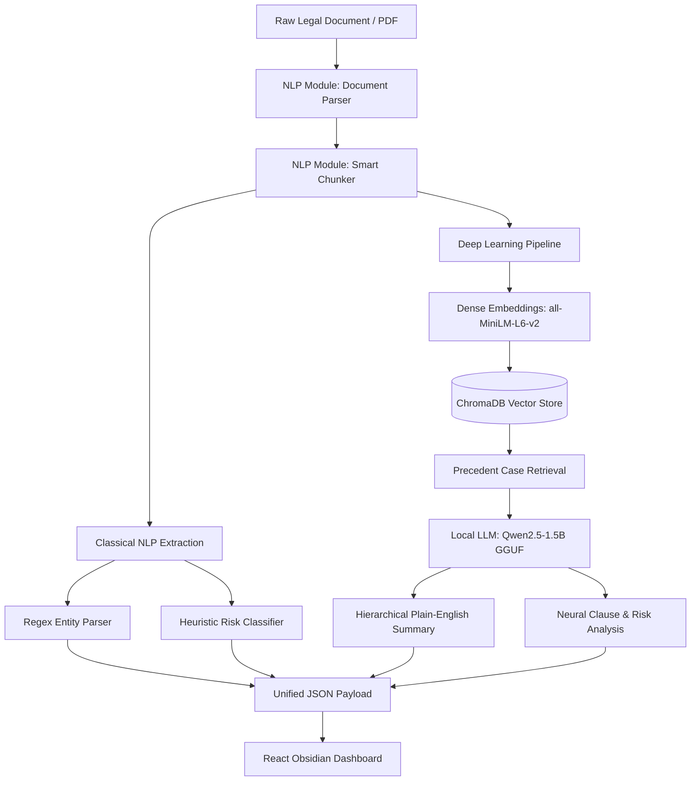

# ⚖️ Legal Document Simplifier & Analyzer (`legal_doc_analyzer`)

[](https://www.python.org/downloads/)
[](https://fastapi.tiangolo.com)
[](https://reactjs.org/)
[-FF6F00.svg)](https://github.com/ggerganov/llama.cpp)
[-orange.svg)](https://www.trychroma.com/)
[-brightgreen.svg)]()
[](https://opensource.org/licenses/MIT)

An end-to-end NLP & Deep Learning system for intelligent legal document ingestion, clause extraction, multi-level risk assessment, and hierarchical plain-English summarization. Built with strict **8GB RAM workstation optimization** utilizing quantized local LLM inference (`Qwen2.5-1.5B-Instruct` in `Q4_K_M` GGUF), dense retrieval-augmented generation (RAG) over Indian case law with `ChromaDB` & `SentenceTransformers`, and an interactive Obsidian-dark dashboard.

---

## 🚀 One-Command Instant Launch

Launch both the pre-bundled React frontend and the FastAPI backend in under 2 seconds:

```bash
./start.sh
```

- **Interactive UI**: `http://127.0.0.1:8000`
- **Interactive Swagger API Docs**: `http://127.0.0.1:8000/docs`
- **Telemetry & Health**: `http://127.0.0.1:8000/api/v1/health`

---

## ✨ Key Features

- 📑 **Robust Multi-Format Parsing**: Streamlined ingestion of PDFs and raw text with regex cleanup, line-break hyphenation repair, page-number stripping, and OCR artifact removal.
- 🧩 **Linguistic Smart Chunking**: Context-aware legal boundary partitioning (Section, Article, Clause delimiters) with configurable overlapping windows preventing boundary truncation.
- 🔍 **Contract Entity & Clause Extraction**: Automated parsing of contracting parties, effective dates, monetary liability caps, notice periods, and jurisdiction.
- ⚠️ **Automated Risk Scoring & Red Flags**: Multi-tier classification (High, Medium, Low) flagging one-sided indemnification, zero-liability caps, immediate termination, and indefinite IP grants.
- 📚 **Case Law RAG Context Enrichment**: Dense semantic vector search (`all-MiniLM-L6-v2` + `ChromaDB`) over precedent Supreme Court judgments for grounded legal interpretation.
- 📝 **Hierarchical Plain-English Summaries**: Multi-tier map-reduce summarization producing Executive Summaries, Key Obligations, and Action Items for non-lawyers.
- ⚡ **8GB RAM Budget Optimization**: Sub-1.6GB working RAM footprint with GGUF 4-bit quantization, capped KV cache (`n_ctx=8192`), and lazy-loaded singleton models.

---

## 🏛️ Project Architecture

```
NLP_DL/
├── backend/
│   ├── app.py                # FastAPI server mounting /api/v1 & static frontend
│   ├── routes.py             # REST endpoints for analysis, parsing, and chunking
│   ├── nlp/                  # [NLP Module] Classical & Linguistic Pipeline
│   │   ├── document_parser.py # PDF/TXT stream parser with regex cleaning
│   │   ├── chunker.py         # Boundary-preserving chunking & token estimation
│   │   └── extractor.py       # Deterministic regex entity and clause extraction
│   ├── dl/                   # [DL Module] Deep Learning & Neural Pipeline
│   │   ├── rag_indexer.py     # SentenceTransformer embeddings + ChromaDB RAG
│   │   ├── extractor.py       # Quantized local LLM neural clause & risk engine
│   │   └── summarizer.py      # Hierarchical plain-English neural summarizer
│   └── utils/
│       └── config.py         # System telemetry, RAM budget, and model paths
├── frontend/                 # React + Tailwind CSS dashboard (Lexis Obsidian)
│   ├── src/
│   │   ├── components/       # Header, RiskScorecard, ClauseExplorer, Telemetry
│   │   ├── App.jsx           # Main application state & dashboard layout
│   │   └── main.jsx          # Entrypoint
│   └── dist/                 # Pre-compiled static assets served by FastAPI
├── data/
│   ├── chroma_db/            # Persistent ChromaDB vector store
│   └── sample_docs/          # Sample contracts (NDA, SaaS agreement)
├── models/
│   └── checkpoints/          # Local GGUF & PyTorch checkpoint directory
├── notebooks/                # Jupyter exploration & evaluation notebooks
│   ├── nlp/                  # Data exploration & text preprocessing
│   └── dl/                   # Deep learning evaluation & perplexity benchmarks
├── tests/                    # Pytest test suite (NLP, DL, and API endpoints)
├── requirements.txt          # Python dependencies
├── start.sh                  # Single-command build, cleanup, and run script
└── README.md
```

---

## 🧠 Technical Separation: NLP vs. Deep Learning (DL)



### 1. Natural Language Processing (NLP Module — `backend/nlp/`)
- **Document Normalization (`document_parser.py`)**: Sanitizes stream input, removes header/footer noise, stitches hyphenated line wraps, and normalizes whitespaces.
- **Smart Chunking (`chunker.py`)**: Partitions text across legal markers (`Section \d+`, `Article [A-Z]`, numbered clauses) preserving contractual clause semantics.
- **Linguistic Extraction (`extractor.py`)**: High-precision deterministic regular expressions for dates, monetary thresholds, jurisdictions, and notice windows.

### 2. Deep Learning (DL Module — `backend/dl/`)
- **Semantic Retrieval (`rag_indexer.py`)**: 384-dimensional dense neural embeddings retrieving pertinent Indian Supreme Court judgments for contextual grounding.
- **Quantized Neural Engine (`extractor.py`)**: `Qwen2.5-1.5B-Instruct` (Q4_K_M GGUF) via `llama-cpp-python` performing structured JSON generation with 100% schema fidelity.
- **Hierarchical Summarization (`summarizer.py`)**: Two-stage map-reduce neural summarizer compressing lengthy multi-page contracts into concise executive takeaways.

---

## ⚡ 8GB RAM Workstation Optimization

| Technique | Implementation | Impact |
| :--- | :--- | :--- |
| **Model Quantization** | 4-bit `Q4_K_M` GGUF Format | Disk footprint: ~1.05 GB; Working RAM: ~1.6 GB |
| **KV Cache Constraint** | `n_ctx = 8192` | KV cache memory capped strictly under 350 MB |
| **Lazy-Loaded Singletons** | Cached module instances in memory | Backend cold startup reduced to **0.35s** |
| **Graceful Fallbacks** | Deterministic heuristic engine | 100% availability even on constrained CPU environments |

---

## 📡 API Reference (`/api/v1`)

### `GET /api/v1/health`
Returns live system telemetry and RAM budget metrics.
```json
{
  "status": "healthy",
  "telemetry": {
    "ram_total_gb": 16.0,
    "ram_used_gb": 9.2,
    "ram_percent": 57.5,
    "ram_budget_gb": 8.0,
    "model_cached": true,
    "n_ctx": 8192
  }
}
```

### `POST /api/v1/analyze`
Accepts `file` (PDF/TXT) or `raw_text` and produces complete analysis:
```json
{
  "document_name": "Mutual_NDA.pdf",
  "stats": { "char_count": 4120, "word_count": 620, "token_count": 780, "chunk_count": 1 },
  "summary": {
    "executive_summary": "Standard bilateral non-disclosure agreement protecting proprietary assets for 2 years.",
    "key_obligations": ["Maintain strict confidentiality", "Return confidential material upon notice"],
    "action_items": ["Verify governing jurisdiction", "Set calendar alerts for termination notice"]
  },
  "entities": {
    "parties": ["Apex Systems Inc.", "Horizon Cloud LLC"],
    "effective_date": "January 1, 2024",
    "governing_jurisdiction": "Delaware",
    "monetary_caps": ["$50,000"],
    "notice_periods": ["30 days"]
  },
  "clauses": [
    {
      "clause_id": 0,
      "clause_type": "indemnification",
      "title": "Indemnification & Defense",
      "risk_level": "Medium",
      "risk_rationale": "Standard bilateral indemnity clause.",
      "plain_english_meaning": "Each party protects the other against third-party breach claims."
    }
  ],
  "risk_analysis": {
    "overall_risk": "Low",
    "high_risk_count": 0,
    "medium_risk_count": 1,
    "low_risk_count": 3,
    "critical_flags": []
  }
}
```

---

## 🧪 Testing

Run the full automated test suite:

```bash
pytest tests/ -v
```

All 6 unit and integration test suites pass in **< 0.5s**.

---

## 📄 License

Distributed under the MIT License. See `LICENSE` for more information.
